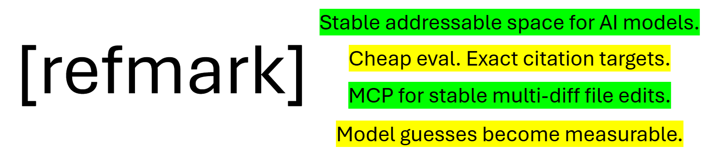
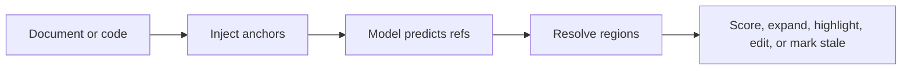

# [refmark]

Turn your corpus into a regression test suite for retrieval.

Refmark turns documents and code into a stable, addressable evidence space for
AI systems. Once a corpus has refs like `policy:P13`, any retriever, reranker,
embedder, query rewriter, context-expansion policy, citation generator, or small
trained resolver can be evaluated by the same concrete question:

> Did it recover the correct source region or range?

That makes RAG evaluation feel more like CI than one-off answer judging. When
the corpus changes, Refmark can identify which refs changed or disappeared so
only affected evaluation and training examples need review.

Short version: model guesses become measurable.

## 30-Second Mental Model

Given a document with addressable regions, a pipeline predicts which refs or
ref ranges answer a question. Refmark resolves those ids back to source text
and scores evidence recovery deterministically, before you judge generated
prose.

```text
Document:
[@P12] Refunds are available within 30 days.
[@P13] Expedited shipping is non-refundable.

Question:
Which clause says expedited shipping is non-refundable?

Pipeline output:
["P13"]

Refmark resolves:
P13 -> "Expedited shipping is non-refundable."

Result:
exact evidence match
```

The same gold example can compare multiple retrieval stacks:

```text
Gold:
  query: "Which clause says expedited shipping is non-refundable?"
  gold_refs: ["policy:P13"]

Pipeline A:
  top-5 refs = ["policy:P02", "policy:P09", "policy:P13"]
  hit@1 = false
  hit@5 = true

Pipeline B:
  top-5 refs = ["policy:P13", "policy:P14", "policy:P12"]
  hit@1 = true
  gold_coverage = 1.0

After corpus update:
  policy:P13 changed
  eval examples depending on policy:P13 are marked stale
```



## Use Refmark For

- **Corpus CI for RAG:** keep `query -> gold refs/ranges` examples and compare
  arbitrary retrieval stacks by hit@k, coverage, precision, context cost, and
  stale-ref status.
- **Retriever/reranker/embedder evaluation:** plug in BM25, embeddings, hybrid
  search, rerankers, query rewriting, or vector DB results and score all of
  them against the same evidence refs.
- **Citation evaluation:** ask a model for refs, then score exact hits,
  overlap, overcitation, undercitation, and wrong-location errors without an
  LLM judge.
- **RAG and review pipelines:** map documents into addressable regions, keep
  refs as metadata, and expand retrieved hits to neighboring context.
- **Existing chunked RAG:** keep your current chunker and retriever, but attach
  stable ref ids so retrieved chunks become testable evidence with clearer
  churn control and anomaly checks.
- **Production feedback loops:** aggregate real query/click/manual-selection
  events into reviewable alias, confusion, query-magnet, no-answer, and
  coverage-gap candidates.
- **Portable documentation search:** turn a folder of docs into Refmark regions,
  enrich each region once with cheap LLM retrieval views, and ship a small
  local BM25 JSON index that needs no runtime model.
- **Human-in-the-loop audits:** render highlighted source regions so reviewers
  inspect what a model actually cited.
- **Bounded code edits:** target stable same-file regions instead of line
  numbers when applying multi-region model patches.

This does not guarantee that a model or retriever picked the right region. It
guarantees a different and useful thing: refs exist, resolve back to source
text, and can be audited and regression-tested. For review workflows, an
irrelevant citation and a fabricated citation are not the same failure.
Irrelevance is way easier to spot in review.

Once a corpus has addresses, citation behavior becomes structured data:
exact hits, overlap, overcitation, undercitation, wrong-region hits, and
scattered citations can be measured without an LLM judge. Those failures are
often useful signals in their own right. Repeated wrong-region hits can reveal
ambiguous passages, stale labels, weak questions, or missing support. Diffuse
"all around" citations can indicate that no clean support span exists or that
the anchor granularity is wrong.

The same addressability primitive also supports stable same-file multi-region
edits. Instead of asking a model to patch drifting line numbers or copied
context, Refmark lets tools target explicit regions and apply bounded edits
through `apply_ref_diff`.

## Public Surface

The stable package surface is intentionally small:

- `CorpusMap`, `EvalExample`, `EvalSuite`, and `EvalRun` for evidence-region
  evaluation.
- `map`, `expand`, `pack-context`, `build-index`, `search-index`, and
  `eval-index` for corpus-to-eval workflows.
- `feedback-diagnostics` and `analyze_feedback` for turning production search
  events into adaptation review queues.
- `discover`, `discovery-map`, and `repair-discovery-clusters` for reviewable
  corpus overview maps and discovery-agent repair loops.
- `highlight`, `parse_citation_refs`, and citation scoring helpers for
  reviewable model citations.
- `Refmarker` for pass-through marking and shadow registries.
- `apply_ref_diff` and the MCP server for bounded same-file multi-region edits.

Research demos, benchmark outputs, and training experiments are kept separate
from the core claim. They are useful because the same refs/ranges make their
successes and failures measurable.

## Quick Start

```bash
pip install -e .[dev,mcp,typescript,documents,train]
python -m refmark.cli languages
python -m refmark.cli smoke
python -m refmark_train.verify_publish_artifact
python -m refmark_train.smoke
python examples/citation_qa/run_eval.py
python examples/data_smells/run.py
python examples/judge_free_rewards/run.py
python examples/multidiff_demo/run.py
python examples/pipeline_primitives/run.py
python examples/coverage_alignment/run.py
python -m refmark.cli build-index examples/portable_search_index/sample_corpus -o examples/portable_search_index/output/index_local.json
python -m refmark.cli export-browser-index examples/portable_search_index/output/index_local.json -o examples/portable_search_index/output/index_browser.json
pytest
```

To try the CLI on a real file without mutating the example source:

```bash
python -m refmark.cli inject examples/multidiff_demo/source.py --output marked.py
python -m refmark.cli highlight marked.py --refs F02,F03 --format text
```

To make a paste-ready prompt for a general chat model:

```bash
python -m refmark.cli enrich-prompt docs/policy.md --question "Which regions support the refund policy?"
```

To build and use a region manifest in a simple retrieval or review pipeline:

```bash
python -m refmark.cli map docs/policy.md -o .refmark/policy_manifest.jsonl --marked-dir .refmark/marked
python -m refmark.cli expand .refmark/policy_manifest.jsonl --refs P03 --before 1 --after 1
python -m refmark.cli pack-context .refmark/policy_manifest.jsonl --refs P03 --format text
python -m refmark.cli align old_policy.docx new_policy.pdf --top-k 2 --coverage-html coverage_review.html
```

To turn production search events into targeted improvement candidates:

```bash
python -m refmark.cli feedback-diagnostics feedback.jsonl \
  --manifest .refmark/policy_manifest.jsonl \
  -o feedback_report.json
```

Citation ranges and edit ranges intentionally differ. Citation ranges such as
`policy:P03-P05` are inclusive evidence ranges; `apply_ref_diff` boundary
ranges stop before `end_ref`. See [Range And Citation Semantics](docs/RANGE_AND_CITATION_SEMANTICS.md).

## Evidence Evaluation API

`EvalSuite` is the attach point for existing RAG systems. It does not care
whether hits came from BM25, embeddings, a vector database, a reranker, query
rewriting, or a small trained resolver. The retriever only has to return refs
or hits that contain refs.

```python
from refmark import CorpusMap, EvalExample, EvalSuite

corpus = CorpusMap.from_manifest(".refmark/policy_manifest.jsonl", revision_id="git:abc123")
suite = EvalSuite(
    corpus=corpus,
    examples=[
        EvalExample(
            query="Which clause says expedited shipping is non-refundable?",
            gold_refs=["policy:P13"],
        ).with_source_hashes(corpus)
    ],
)

def my_retriever(query: str):
    # Return stable refs, dicts, SearchHit-like objects, or hits with context_refs.
    return ["policy:P09", {"stable_ref": "policy:P13", "context_refs": ["policy:P12", "policy:P13"]}]

run = suite.evaluate(my_retriever, k=5)
print(run.metrics)
print([item.to_dict() for item in suite.stale_examples()])
```

The map can live outside the source document. Treat it like a shadow manifest
for one source revision: rebuild it after an update, diff it against the
previous map, then keep eval/training rows whose refs are unchanged and
regenerate only rows that point at changed or removed regions.

```python
previous = CorpusMap.from_manifest(".refmark/policy_manifest.rev-a.jsonl", revision_id="rev-a")
current = CorpusMap.from_manifest(".refmark/policy_manifest.rev-b.jsonl", revision_id="rev-b")

diff = current.diff_revision(previous)
print(diff.to_dict())
print([item.to_dict() for item in diff.stale_examples(suite.examples)])
```

For JSONL eval suites:

```jsonl
{"query":"Which clause says expedited shipping is non-refundable?","gold_refs":["policy:P13"]}
{"query":"What evidence covers refunds and shipping?","gold_refs":["policy:P12-policy:P13"]}
```

```python
from refmark import CorpusMap, EvalSuite

corpus = CorpusMap.from_manifest(".refmark/policy_manifest.jsonl")
suite = EvalSuite.from_jsonl(
    "eval_questions.jsonl",
    corpus=corpus,
    attach_source_hashes=True,
)

runs = suite.compare(
    {
        "bm25": bm25_retriever,
        "embedding": embedding_retriever,
        "hybrid": hybrid_retriever,
    },
    k=10,
)

for name, run in runs.items():
    run.write_json(f"runs/{name}.json")
    print(name, run.metrics)
```

To use the CLI as a CI gate, keep the search index as the retriever artifact and
optionally provide the current manifest as the lifecycle/staleness artifact:

```bash
python -m refmark.cli eval-index docs.refmark-index.json eval_questions.jsonl \
  --manifest .refmark/policy_manifest.jsonl \
  --top-k 10 \
  --min-hit-at-k 0.80 \
  --max-stale 0 \
  --fail-on-regression \
  -o runs/eval.json
```

To score an existing retrieval service instead of the built-in BM25 index, pass
an endpoint that accepts `{"query": "...", "top_k": 10}` and returns either
`{"refs": ["policy:P13"]}` or `{"hits": [{"stable_ref": "policy:P13", "score": 0.9}]}`:

```bash
python -m refmark.cli eval-index docs.refmark-index.json eval_questions.jsonl \
  --retriever-endpoint http://localhost:8000/retrieve \
  --min-hit-at-k 0.80 \
  --fail-on-regression
```

For batch/offline systems, export one JSONL row per query and score it without
running a service:

```jsonl
{"query":"Which clause says expedited shipping is non-refundable?","hits":[{"stable_ref":"policy:P13","score":0.91}]}
```

```bash
python -m refmark.cli eval-index docs.refmark-index.json eval_questions.jsonl \
  --retriever-results exported_hits.jsonl \
  --min-hit-at-k 0.80
```

Retriever outputs can be plain stable refs, dictionaries, or small objects:

```python
[
    "policy:P13",
    {"stable_ref": "policy:P12", "score": 0.72},
    {
        "stable_ref": "policy:P12",
        "context_refs": ["policy:P12", "policy:P13"],
        "score": 0.66,
    },
]
```

The report includes exact hits, range/context coverage, precision, score-margin
diagnostics, hard-ref heatmaps, wrong-top confusions, stale examples, and
adaptation hints. That makes retrieval quality inspectable below answer prose:
you can see whether a pipeline found the evidence required to answer.

To build a tiny searchable documentation index:

```bash
python -m refmark.cli build-index docs -o docs.refmark-index.json --source openrouter --model mistralai/mistral-nemo
python -m refmark.cli search-index docs.refmark-index.json "How do I configure retention?" --expand-after 1
python -m refmark.cli eval-index docs.refmark-index.json eval_questions.jsonl \
  --top-k 10 \
  --provenance-out runs/docs_eval.provenance.json \
  -o runs/docs_eval.json
python -m refmark.cli export-browser-index docs.refmark-index.json -o docs.refmark-browser.json
```

The build step can spend cheap LLM tokens once to create summaries, likely user
questions, and keywords per region. The search step is local BM25 over the JSON
index, so it can be embedded into documentation tooling without a vector
database or runtime model.

The eval step makes the artifact self-checking: reports include input hashes,
retrieval settings hashes, stale-ref validation, hard-ref/confusion heatmaps,
and score-margin confidence gates. That is the core evidence pipeline: compare
retrieval variants by whether they recover the right refs/ranges, then adapt
the hard zones instead of guessing from answer prose.

For the artifact contract behind reproducible comparisons, see
[Evidence Eval Artifacts](docs/EVIDENCE_EVAL_ARTIFACTS.md). For research
directions that should stay distinct from the core product claim, see
[Refmark Research Angles](docs/RESEARCH_ANGLES.md).

Recent example work adds the next visible layer of that loop: an evidence
heatmap/workbench for a FastAPI documentation corpus. It groups regions by the
existing documentation hierarchy, colors weak and strong retrieval areas,
highlights matching sections by search term, and pins per-block refs, metrics,
and eval questions for review. The heatmap is not a separate product claim; it
is the UI for the same corpus-as-test-suite idea:

```text
evaluate -> heatmap hard zones -> reviewer/agent diagnosis
         -> question or metadata adaptation -> affected-row mini-eval
         -> refreshed report/heatmap
```

The current adaptation loop can propose validation repairs, alternate gold
refs, range extension/splitting, exclusions for query magnets, confusion
mapping, and retrieval-only Doc2Query metadata stored beside refs as shadow
metadata. Reports should keep non-adaptive baselines visible so improvements
remain measurable instead of becoming folklore.

For a browser-only page search, load `refmark/browser_search.js` and the
exported browser index. Elements with `data-refmark-ref="doc:P03"` can be
scrolled and highlighted directly from query results, giving a semantic
`Ctrl+F`-style experience inside a page.

The document workflow can also be driven from Python:

```python
from refmark.documents import align_documents

report = align_documents(
    "customer_request.docx",
    "offer_contract.pdf",
    density="balanced",
    marker_style="explicit",
    include_headings=False,
)
report.write_html("coverage_review.html", layout="side-by-side")
print(report.summary)
```

DOCX/PDF support currently resolves refs to extracted text regions, not
original-layout page boxes. See [Document Extraction And Provenance](docs/DOCUMENT_PROVENANCE.md).

For an existing RAG or review system, use `Refmarker` as a pass-through
addressability layer. Shadow mode keeps your source unchanged and stores the
marked view plus manifest in `.refmark/registry`.

```python
from refmark import Refmarker

marker = Refmarker(mode="shadow")
result = marker.mark_text(policy_text, doc_id="policy")

prompt_context = result.marked_view
stable_regions = result.records
```

## Core Workflow

Models can output raw citation refs such as:

```json
["F03", "F04-F05"]
```

Refmark then makes that output auditable and measurable:

- `refmark.metrics.score_ref_range(...)` scores exactness, overlap, cover,
  precision/recall/F1, breadth, overcite, undercite, and wrong-location rates
- `python -m refmark.cli highlight file.py --refs F03,F04 --format html`
  renders clean source snippets for human review

Text audit output looks like:

```text
[F03] lines 8-11
>    8 | def compute_invoice_total(...):
>    9 |     shipping = 18.0 if expedited else 6.0
>   10 |     taxed = subtotal * (1.0 + TAX_RATE)
>   11 |     return round(taxed + shipping, 2)
```

This is the main research surface: locate-only outputs can be evaluated
deterministically, and misses can be separated into wrong-location failures,
overcitation, undercitation, or boundary mismatch.

## Judge-Free Rewards

For RLHF/DPO-style experiments, refs turn citation grading into deterministic
integer math. A model can emit `["D00284"]`, and the reward can be computed
without an LLM judge:

```python
from refmark.metrics import citation_reward, score_ref_range

score = score_ref_range(["D00283", "D00284"], ["D00284"])
reward = citation_reward(score)
```

The retained `refmark_train/data/documentation_full_paragraph_contextual_idf_lean2`
dataset provides thousands of anchored question/ref pairs for this style of
local reward experiment. Run:

```bash
python examples/judge_free_rewards/run.py
```

## Living Corpus Evaluation

Generating good questions for a fresh corpus is not free. Even with local
models, it costs time, power, and review attention. Refmark changes that cost
model by attaching evaluation examples to stable source addresses.

When the corpus changes, existing questions for unchanged anchors can remain
useful. New generation can focus on added, removed, or touched anchors, while a
cheap local model is retrained against the refreshed address space. That makes
anchored QA closer to regression testing than one-off benchmark construction:
build supervision once, preserve it across ordinary corpus mutations, and spend
generation budget where the corpus actually changed.

The retained `refmark_train` prototype explores this path. It intentionally
overfits small models to a fixed addressable corpus, treating narrow local
specialization as a feature rather than a bug. Current evidence supports this
as a promising corpus-local navigation experiment, not yet as a broad claim
about general model training.

## Current Evidence

The current evidence is strongest for:

- deterministic locate-only citation evaluation and human-auditable source
  review
- stable same-file anchored edits for bounded Python and TypeScript workflows
- data-smell diagnostics from wrong-region, broad, and scattered citations
- lightweight document pipeline primitives such as prompt enrichment, manifest
  generation, neighbor expansion, and lexical region mapping

The current evidence is more limited for:

- broad coding-agent superiority
- universal efficiency gains
- exact-minimal citation as a solved problem
- training-based localization as a proven product path

Existing general LLMs were not specifically trained to use injected anchors.
In local experiments, useful zero-shot anchor use generally appeared in larger
open models, while smaller models often struggled with the notation. Some
bounded SWE-style and multi-diff slices showed positive signals, especially
for weaker or mid-tier models, but strong coding models were often reliable
enough without Refmark.

The research hypothesis is that anchors will matter more when they are part of
the actual training or fine-tuning loop, rather than introduced only at
inference time. In particular, 4B-14B models trained to understand addressable
corpora may become better at local information navigation and bounded code
modification. This artifact is a proof of concept for that path, not proof that
the hypothesis is already solved.

## Recommended Reading Order

- [docs/GETTING_STARTED.md](docs/GETTING_STARTED.md)
- [examples/README.md](examples/README.md)
- [docs/MCP_USAGE.md](docs/MCP_USAGE.md)
- [docs/PUBLICATION_READY.md](docs/PUBLICATION_READY.md)
- [docs/PRODUCTIZATION_TASKS.md](docs/PRODUCTIZATION_TASKS.md)
- [docs/CURRENT_STATE_REVIEW.md](docs/CURRENT_STATE_REVIEW.md)
- [docs/CURRENT_BENCHMARK_SNAPSHOT.md](docs/CURRENT_BENCHMARK_SNAPSHOT.md)
- [docs/TRAINING_PROTOTYPE.md](docs/TRAINING_PROTOTYPE.md)

## Reproducibility Notes

The historical broad benchmark harness is not part of this PoC artifact. The
figures in the benchmark snapshot are retained as research context, while the
publicly runnable checks are:

- `python -m refmark.cli smoke`
- `python -m refmark_train.smoke`
- `python examples/citation_qa/run_eval.py`
- `python examples/data_smells/run.py`
- `python examples/judge_free_rewards/run.py`
- `python examples/pipeline_primitives/run.py`
- `pytest`

The training prototype includes derived datasets and run summaries. Raw and
normalized source documents are intentionally not redistributed; use
`refmark_train/pull_source_docs.py` and the source manifests if you need to
rebuild that corpus from canonical upstream URLs.

## Positioning

Refmark should currently be presented as:

- strong on deterministic locate-only citation evaluation and HiL review
- practical as a small plug-in layer for cited prompts and region manifests
- practical for bounded same-file anchored edits
- promising but still experimental for broader coding-agent claims
- exploratory on trainable corpus-local anchor prediction
